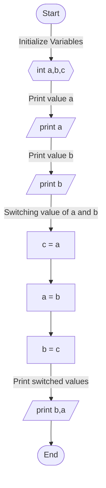
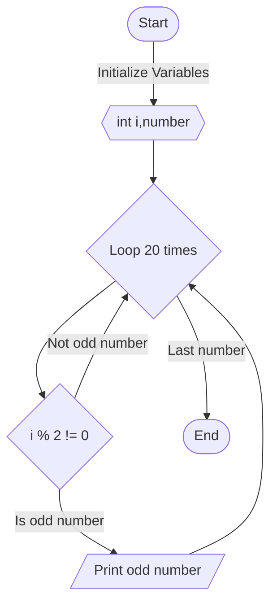
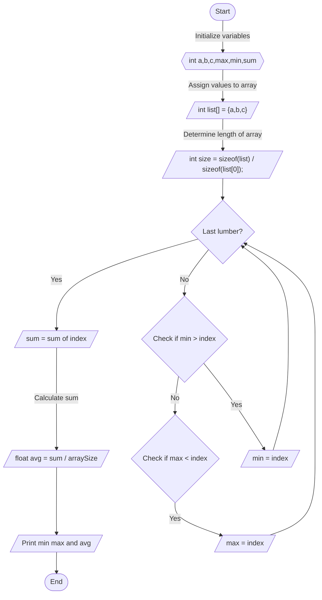

# Asssignment one, algorithm and code

## 1. Switching vars

### Descriptive

Dideklarasikan 3 variable yang bernama a, b, dan c, print isi dari variable-variable tersebut,  
memulai switching value dari masing-masing variable, dimulai dengan `c = a` untuk menukar isi dari a ke c,  
lalu dilanjut `a = b` agar variable a mempunyai value dari variable b,  
dan diakhiri dengan `b = c` agar variable b mendapatkan value dari c yang sudah diisi dengan value a, program selesai

### Flow chart



### Pseudo code

```
DECLARE
    int a,b,c;

ALGORITHM
    ASSIGN VALUE a TO VARIABLE c
    ASSIGN VALUE b TO VARIABLE a
    ASSIGN VALUE c TO VARIABLE b

END
```

### Implementation

```c
#include <stdio.h>

int main() {
    int a = 10, b = 15, c = 0;

    // Initiate Switch
    c = a;
    a = b;
    b = c;

    printf(a, b);
    return 0;
}
```

## 2. Print odd numbers from 1 to 20

### Descriptive
    
Deklarasi index dan number, dimasukan value 20 kepada number, dilakukan pengulangan sebanyak 20 kali, dalam pengulangan tersebut jika index modulo 2 tidak sama dengan 0 maka akan memunculkan bilangan ganjil

### Flow chart



### Pseudo code

```
DECLARE
    int i, number;

    number = 20;
    i = 1;

ALGORITHM
    FOR i LESS THAN 20 DO
        IF i MODULO 2 NOT EQUAL AS 0
        PRINT odd number
        LOOP AGAIN
        ELSE
        LOOP AGAIN
END
```

### Implementation

```c
#include <stdio.h>

int main (int argc, char *argv[])
{
    for (int i = 0; i < 20; i++) {
        if (i % 2 != 0) {
            printf("%d is Prime number\n", i);
        }
    }
    return 0;
}
```

## 3 Calculate Min Max and Average

### Descriptive 

Deklarasi 6 Variable a b c max min dan sum, input inputan dari terminal kedalam variable a b dan c, masukan variabel a b dan c kedalam array, hitung length dari array tersebut, lakukan pengulangan sebanyak jumlah key yang ada di array, dalam pengulangan terdapat 2 validasi yang dimana validasi pertama jika min lebih besar dari index array maka masukan index array menjadi value min dan jika max lebih kecil dari index array maka masukan index array menjadi value max, dan setiap pengulangan masukan sum dari elemen array kedalam sum, buat variable baru bernama avg lalu kalkulasi sum dibagi total element array dan jadikan sebagai value dari avg, terakhir print max min dan avg

### Flow chart



### Pseudo code

```
DECLARE
    int a,b,c,min,max,sum

ALGORITHM
    SCAN a,b,c
    MAKE ARRAY VARIABLE list ELEMENT OF a,b,c
    DETERMINE LENGHT OF ARRAY AS size
    FOR i LESS THAN size DO
        IF min BIGGER THAN ARRAY ELEMENT
            ASSIGN ARRAY ELEMENT TO min
        IF max LESS THAN ARRAY ELEMENT
            ASSIGN ARRAY ELEMENT TO max
        SUM ALL ARRAY ELEMENT AND ASSIGN TO sum

    MAKE FLOAT VARIABLE avg WITH VALUE OF CALCULATED sum / size

    PRINT min, max, avg

END
```

### Implementation

```c
#include <stdio.h>
int main(int argc, char *argv[]) {

  // Initialize 3 integer variable
  int a, b, c;
  // Scan with address of value
  scanf("%d %d %d", &a, &b, &c);
  // Initialize smalest, largest and average variable
  int maxNumber, minNumber, sumNumber;

  int list[] = {a, b, c};
  int size = sizeof(list) / sizeof(list[0]);

  maxNumber = list[0];
  minNumber = list[0];

  for (int i = 0; i < size; i++) {
    // Guard Clause implementation
    // https://blog.yuuriya.tech/engineering/2022/09/18/guard-clauses.html
    if (minNumber > list[i]) {
      minNumber = list[i];
    }
    if (maxNumber < list[i]) {
      maxNumber = list[i];
    }
    sumNumber += list[i];
  }
    float avgNumber = sumNumber / (float)size;

  printf("Biggest Number := %d \n", maxNumber);
  printf("Smallest Number := %d \n", minNumber);
  printf("Average Number := %f \n", avgNumber) ;

  return 0;
}
```
